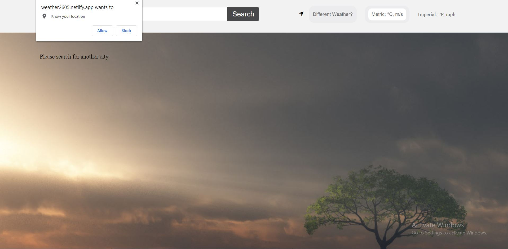
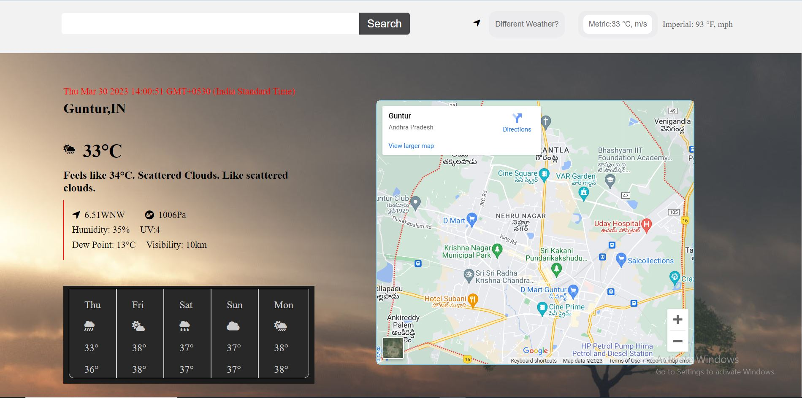
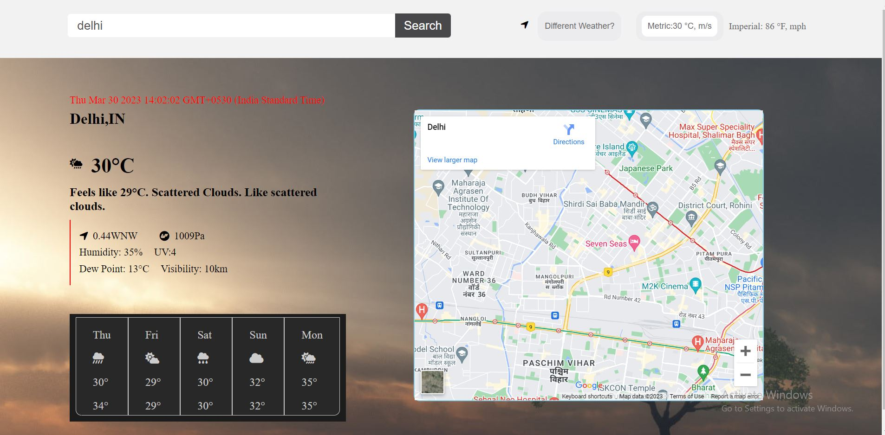

# WeatherApp
A web application for users who want to check the weather.


### Technologies used
* HTML
* CSS
* JavaScript

### Functionalities
* When the app loads, it will automatically show you the weather forecast for your current location.
* To see the forecast for the next five days, simply look at the displayed information.
* If you want to see the forecast for a different city, use the search function.
* To search for a specific city, click on the search icon or the search bar.
* Type the name of the city you want to see the forecast for in the search bar.
* The app will display the weather forecast for that city.

### See Live
Visit the Deployed version using this <a href="https://weather2605.netlify.app/">link</a>  
<hr/>

### Setup
```
https://github.com/syed2605/WeatherApp.git
```

### Images


<br><br>

<br><br>

<br>
